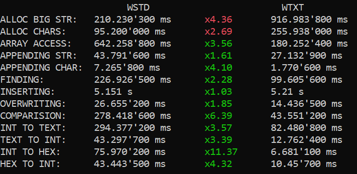

# ScienceDiscoverer's STD Libriaries

Features:
* Fully functional, minimal and fast text type (aka. string). It has no public functions, only operators to make it closely resemble built-in types.
* Wide text type
* Powerfull console writer (replaces `iostream`) with compact syntax that supports colors, formating, pauses, padding, console buffer trimming and more.
* Printer to text type (replaces `stringstream`)
* Usefull little debug libriary - set breakpoins without debugger, quickly print variables, display caught exceptions information and more.

Not yet implemented:
* Convertion between UTF16 and UTF8 texts using UNICODE.
* Convertion to/from text types from/to floating point numbers.
* Printing floating point numbers

Performance comparation with standart C++ libriaries (`wtxttst.cpp`):

